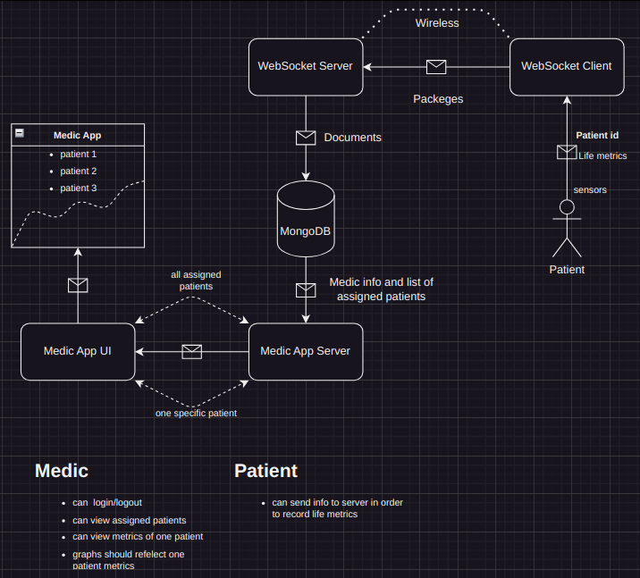
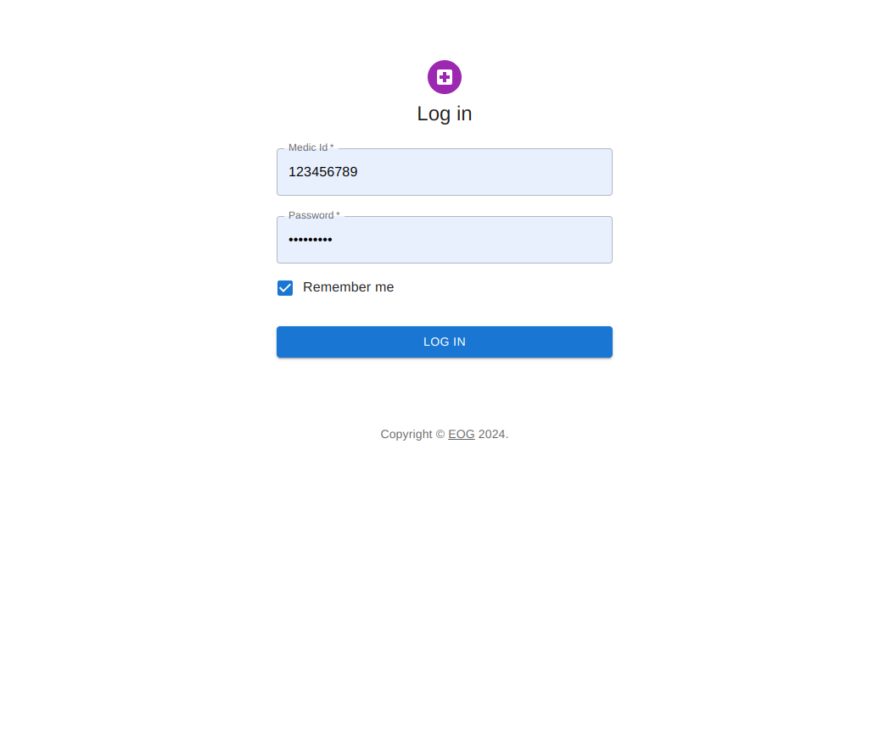
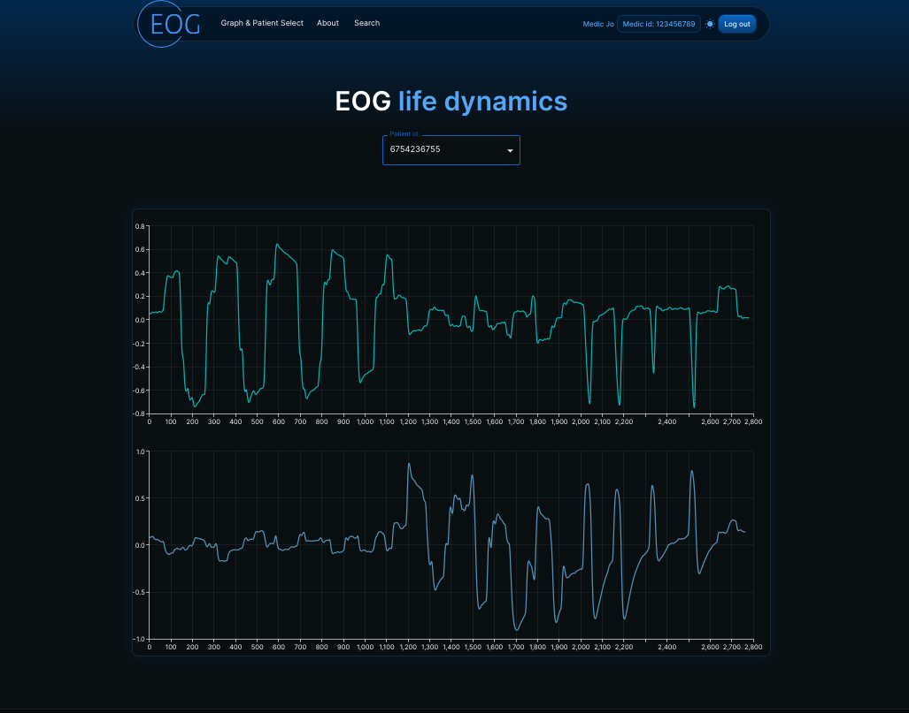
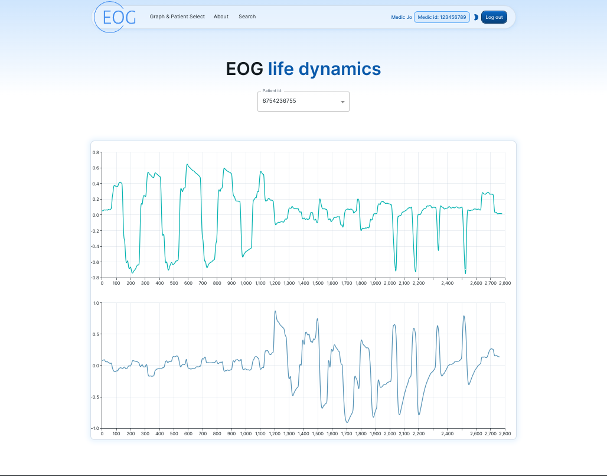
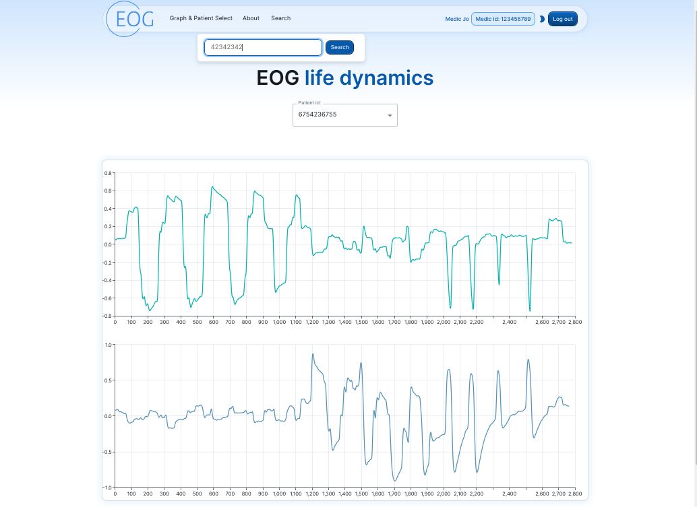

### Project Structure:

- Medic App UI
- Medic App Server
- WebSocket Server
- WebSocket Client
- libraries
- Zips
- images

### Project Schema:

### Project Description:

A project that records metrics from sensors connected via ESP board to Wireless communication and sends data via a network to a MongoDB cluster in order to process it later and show charts.

The medic interface can view assigned patient and view their dynamics.

### Medic App UI

Login page:

Dashboard Dark Mode

Dashboard White Mode

Dashboard Search Modal

